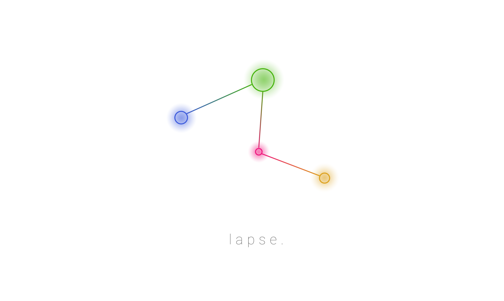
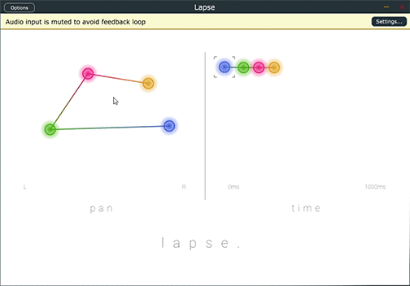
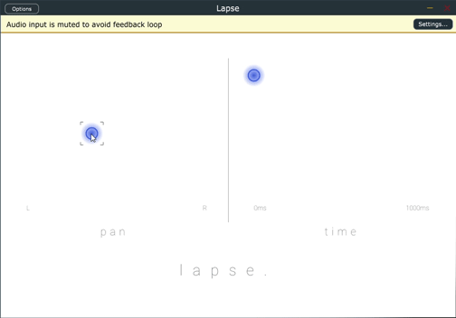

Lapse is a node-based delay plugin designed to visually represent delay in an interactive way. Lapse will allow you to create awesome delays through automating delay time, feedback, and panning parameters through its intuitive user interface.

### Current State:
------------------

In Lapse's current state of development, the following main tasks are yet to be implemented:

	Timer system to change between nodes. This means that only the first node created is currently functional.
	
	Mapping of Delay Time to time intervals relative to bpm and time signature of DAW.

	Reverse effect determined by relative position of previous node in time area.

	Saving node parameters after closing GUI in DAW.

How to use:

1. Add Lapse to a track in your chosen DAW.

2. Double click to create a delay node.

3. Click and drag on a node to change parameter values.

To install on MacOSX:

1. Open the XCode project in Builds/MacOSX. 

2. Build and run to generate the VST and standalone application, make sure to select the release build in your IDE.

3. Copy the VST into your plugin folder for your chosen DAW.

4. Launch VST within chosen DAW

To install on Windows:

1. Copy either the Lapse.dll (vst2) or Lapse.vst (vst3) from the Builds/Windows folder into the vst folder of your chosen DAW.

2. Launch VST within chosen DAW
