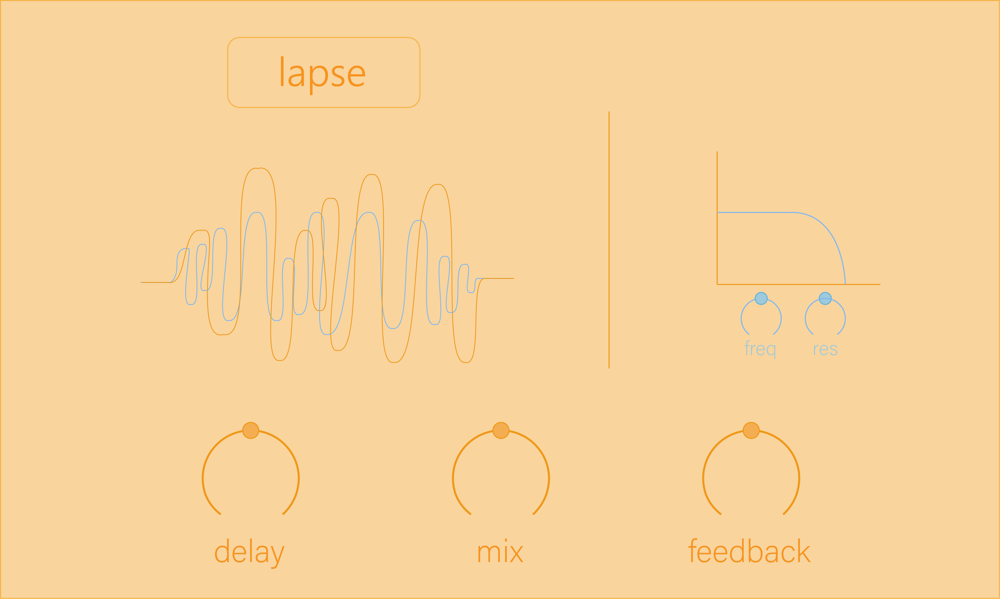

# Lapse

Lapse is a basic delay plugin with Mix, Feedback, and Delay Time parameters. Lapse also has included a state variable filter.

To run on MacOSX, open the XCode project in Builds/MacOSX. Build and run to generate the VST and standalone application.

Copy the VST into your plugin folder for your chosen DAW and it should be good to go :)
